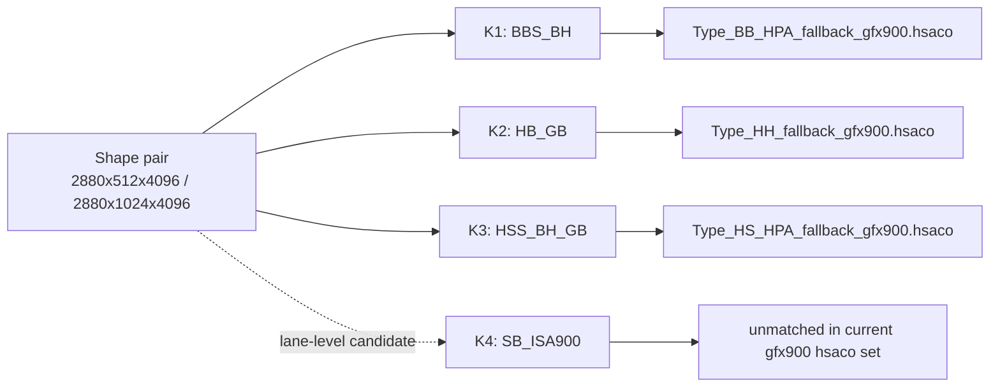

# Shape Kernel Priority Memo: 2880x512x4096

Last updated: 2026-03-25
Class: observation-only (no code/asset modification)

## 1. Scope

Target shape pair:

- baseline: `2880x512x4096`
- side: `2880x1024x4096`

## 2. Stable observation snapshot

- [main-node confirmed] baseline lane:
  - `shape_2880x512x4096=96`
  - `direct/fallback/dispatch=1`
- [main-node confirmed] side lane:
  - `shape_2880x1024x4096=144`
  - `direct/fallback/dispatch=1`
- [main-node confirmed] stream window (both lanes):
  - `decode_signature_detected` (3/3 rows)

## 3. Candidate priority (lane-level shared set)

Priority is based on current `tensile_cijk` candidate score and HSACO mapping.

| Priority | Kernel ID | Candidate family | prefill/full count | HSACO map |
|:--|:--|:--|:--|:--|
| P1 | K1 | `Cijk_*_BBS_BH_*` | `96 / 96` | matched (`Type_BB_HPA`) |
| P2 | K2 | `Cijk_*_HB_GB_*` | `24 / 24` | matched (`Type_HH`) |
| P2 | K3 | `Cijk_*_HSS_BH_GB_*` | `24 / 24` | matched (`Type_HS_HPA`) |
| P3 | K4 | `Cijk_*_SB_*_ISA900` | `23 / 23` | unmatched (current `*gfx900*.hsaco` scan) |

## 4. Visual map

## 5. Guardrail

- [main-node confirmed] Candidate list is stable across baseline/side lanes.
- [inference] This memo is shape-focused prioritization, not single-shape dispatch proof.
- Keep `prefill/full proxy` and `stream-window proxy` as separate evidence layers.

## 6. References

- `/home/limonene/ROCm-project/vega_path_check_logs_raw/summaries/g4_gptoss_anchor_shape_sweep_gpt-oss_latest_20260325_022355.txt`
- `/home/limonene/ROCm-project/vega_path_check_logs_raw/summaries/g4_gptoss_anchor_shape_sweep_gpt-oss_latest_20260325_022435.txt`
- `/home/limonene/ROCm-project/vega_path_check_logs_raw/summaries/g4_stream_phase_window_sweep_gpt-oss_latest_20260325_022802.txt`
- `/home/limonene/ROCm-project/vega_path_check_logs_raw/summaries/g4_stream_phase_window_sweep_gpt-oss_latest_20260325_022953.txt`
- `/home/limonene/ROCm-project/vega_path_check_logs_raw/summaries/kernel_candidates_rocprofv3_summary_gpt-oss_latest_20260325_022545__rocprofv3_summary_gpt-oss_latest_20260325_022614_20260325_023311.tsv`
- `/home/limonene/ROCm-project/vega_path_check_logs_raw/summaries/hsaco_candidate_map_kernel_candidates_rocprofv3_summary_gpt-oss_latest_20260325_022545__rocprofv3_summary_gpt-oss_latest_20260325_022614_20260325_023311_20260325_023331.tsv`
