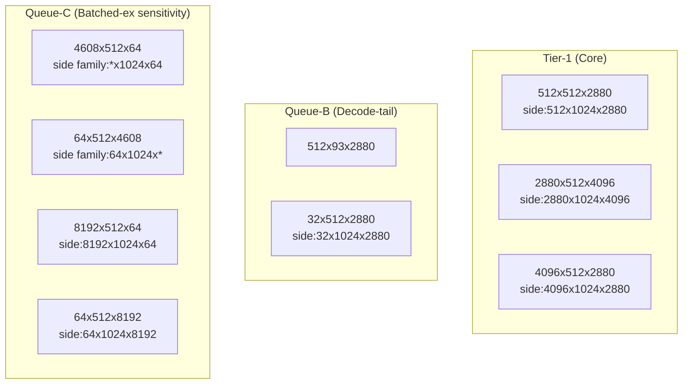
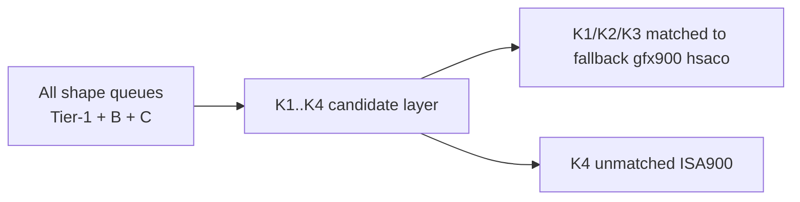

# Shape Priority Overview (Tier-1 + Queue-B/C)

Last updated: 2026-03-25
Scope: observation-only overview for current `gpt-oss` anchor lanes.

## 1. Purpose

This page is a one-sheet index across 9 shape-priority memos.

- Tier-1 (core high-frequency)
- Queue-B (decode-tail candidates)
- Queue-C (batched-ex sensitivity family)

No low-level code/asset changes are included here.

## 2. Queue Map

## 3. Current Priority Table

| Queue | Shape focus | Baseline observed | Side observed | Memo |
|:--|:--|:--|:--|:--|
| Tier-1 | `512x512x2880` | 192 | 288 | `shape_512x512x2880_kernel_priority.md` |
| Tier-1 | `2880x512x4096` | 96 | 144 | `shape_2880x512x4096_kernel_priority.md` |
| Tier-1 | `4096x512x2880` | 96 | 144 | `shape_4096x512x2880_kernel_priority.md` |
| Queue-B | `512x93x2880` | 48 | 48 | `shape_512x93x2880_kernel_priority.md` |
| Queue-B | `32x512x2880` | 46 | 69 (`32x1024x2880`) | `shape_32x512x2880_kernel_priority.md` |
| Queue-C | `4608x512x64` | 24 | 36-family (`5120x1024x64`,`8192x1024x64`) | `shape_4608x512x64_kernel_priority.md` |
| Queue-C | `64x512x4608` | 24 | 36-family (`64x1024x5120`,`64x1024x8192`) | `shape_64x512x4608_kernel_priority.md` |
| Queue-C | `8192x512x64` | 24 | 36 (`8192x1024x64`) | `shape_8192x512x64_kernel_priority.md` |
| Queue-C | `64x512x8192` | 24 | 36 (`64x1024x8192`) | `shape_64x512x8192_kernel_priority.md` |

## 4. Shared Candidate/HSACO Layer

All 9 memos currently share the same lane-level candidate set and mapping:

- candidates:
  - `K1: Cijk_*_BBS_BH_*`
  - `K2: Cijk_*_HB_GB_*`
  - `K3: Cijk_*_HSS_BH_GB_*`
  - `K4: Cijk_*_SB_*_ISA900`
- HSACO map:
  - `K1/K2/K3`: matched (`Type_BB_HPA`, `Type_HH`, `Type_HS_HPA`)
  - `K4`: unmatched in current `*gfx900*.hsaco` scan

## 5. Interpretation Guardrail

- `prefill/full proxy` and `stream-window proxy` are complementary.
- This overview is for prioritization and navigation.
- It is not a claim of single-shape direct dispatch attribution.

## 6. References

- `/home/limonene/ROCm-project/ROCm-repos_AETS/rocBLAS/shape-observations/tier1_shape_correlation_map.md`
- `/home/limonene/ROCm-project/vega_path_check_logs_raw/summaries/g4_gptoss_anchor_shape_sweep_gpt-oss_latest_20260325_022355.txt`
- `/home/limonene/ROCm-project/vega_path_check_logs_raw/summaries/g4_gptoss_anchor_shape_sweep_gpt-oss_latest_20260325_022435.txt`
- `/home/limonene/ROCm-project/vega_path_check_logs_raw/summaries/kernel_candidates_rocprofv3_summary_gpt-oss_latest_20260325_022545__rocprofv3_summary_gpt-oss_latest_20260325_022614_20260325_023311.tsv`
- `/home/limonene/ROCm-project/vega_path_check_logs_raw/summaries/hsaco_candidate_map_kernel_candidates_rocprofv3_summary_gpt-oss_latest_20260325_022545__rocprofv3_summary_gpt-oss_latest_20260325_022614_20260325_023311_20260325_023331.tsv`
