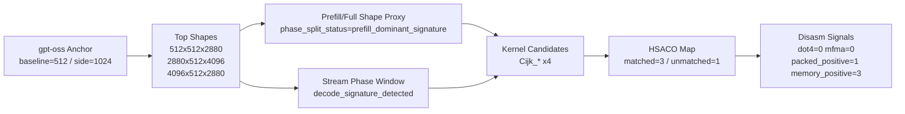
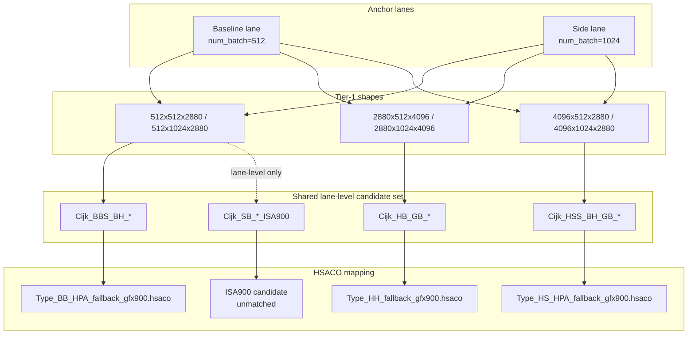

# Tier-1 Shape Correlation Map (Observation-Only)

Last updated: 2026-03-25
Scope: `gpt-oss` anchor lane (`ROCBLAS_LAYER=9`, baseline/side), no kernel/source modification.

## 1. What This Map Is

This note visualizes the current evidence chain:

1. top shapes are stable in baseline/side lanes
2. prefill/full and stream-window probes are both captured
3. candidate kernels are narrowed
4. candidates are mapped to fallback HSACO files
5. disasm signal summaries are attached

This is an observation map, not a code-change plan.

## 2. Evidence Pipeline

## 3. Tier-1 Shape View

## 4. Evidence Class Guardrail

- `prefill/full shape proxy`:
  - good for shape-count deltas
  - not sufficient alone for token-level dispatch attribution
- `stream phase-window`:
  - complementary decode-side proxy
  - use together with gate fields (`direct/fallback/dispatch`)
- `candidate -> hsaco`:
  - links likely kernel family to concrete files
  - still requires careful per-shape attribution evidence

## 5. Current Status (Fact vs Inference)

- [main-node confirmed] baseline and side lanes both keep `direct/fallback/dispatch=1`.
- [main-node confirmed] stream phase-window is `decode_signature_detected` in both lanes.
- [main-node confirmed] Cijk candidate mapping remains `4 -> 3 matched + 1 unmatched`.
- [inference] per-shape attribution is still lane-level correlated, not yet single-shape dispatch proof.

## 6. References

- `/home/limonene/ROCm-project/vega_path_check_logs_raw/summaries/g4_gptoss_anchor_shape_sweep_gpt-oss_latest_20260325_022355.txt`
- `/home/limonene/ROCm-project/vega_path_check_logs_raw/summaries/g4_gptoss_anchor_shape_sweep_gpt-oss_latest_20260325_022435.txt`
- `/home/limonene/ROCm-project/vega_path_check_logs_raw/summaries/g4_prefill_decode_split_gpt-oss_latest_20260325_022531.txt`
- `/home/limonene/ROCm-project/vega_path_check_logs_raw/summaries/g4_prefill_decode_split_gpt-oss_latest_20260325_022637.txt`
- `/home/limonene/ROCm-project/vega_path_check_logs_raw/summaries/g4_stream_phase_window_sweep_gpt-oss_latest_20260325_022802.txt`
- `/home/limonene/ROCm-project/vega_path_check_logs_raw/summaries/g4_stream_phase_window_sweep_gpt-oss_latest_20260325_022953.txt`
- `/home/limonene/ROCm-project/vega_path_check_logs_raw/summaries/hsaco_candidate_map_kernel_candidates_rocprofv3_summary_gpt-oss_latest_20260325_022545__rocprofv3_summary_gpt-oss_latest_20260325_022614_20260325_023311_20260325_023331.tsv`
- `/home/limonene/ROCm-project/vega_path_check_logs_raw/summaries/disasm_signal_summary_hsaco_targets_hsaco_candidate_map_kernel_candidates_rocprofv3_summary_gpt-oss_latest_20260325_022545__rocprofv3_summary_gpt-oss_latest_20260325_022614_20260325_023311_20260325_023331_20260325_023347_20260325_023354.txt`
